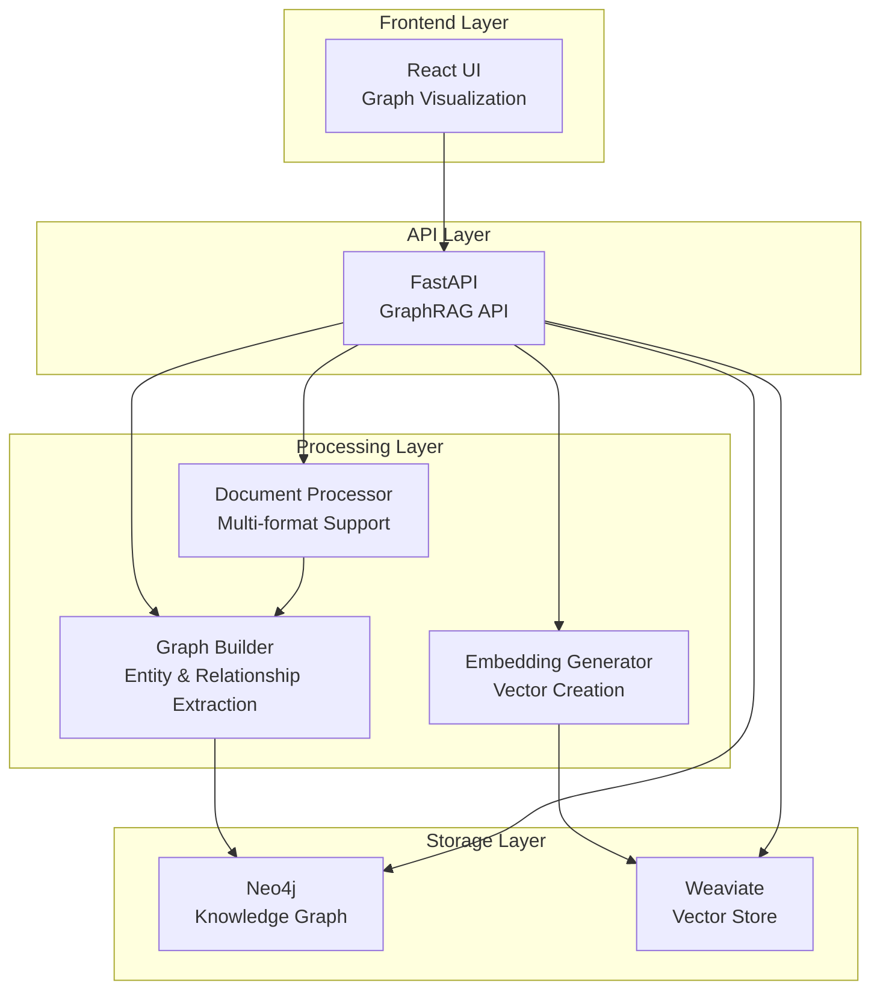

# GraphRAG Knowledge Assistant

Enterprise-grade AI knowledge assistant with GraphRAG (Graph-enhanced Retrieval-Augmented Generation) capabilities.

## 🏗️ Architecture Overview



## 🚀 Quick Start

### Prerequisites

* Docker & Docker Compose
* 8GB+ RAM recommended
* 20GB+ free disk space

### Local Development Setup

```bash
# 1. Clone repository
git clone <repository-url>
cd graphrag-assistant

# 2. Start all services
docker-compose up --build

# 3. Access applications
# - Frontend: http://localhost:3000
# - API: http://localhost:8000
# - Neo4j Browser: http://localhost:7474 (neo4j/password123)
# - API Documentation: http://localhost:8000/docs

# 4. Upload test documents
curl -X POST "http://localhost:8000/upload" \
  -F "file=@your-document.pdf" \
  -F "tenant_id=test"

# 5. View knowledge graph
# Open http://localhost:3000 to explore the interactive graph
```

## 📁 Project Structure

```bash
graphrag-assistant/
├── README.md                 # This file
├── docker-compose.yml        # Container orchestration
├── Dockerfile               # API container build
├── requirements.txt         # Python dependencies
├── main.py                  # FastAPI application
├── graphrag_core.py         # Core GraphRAG logic
├── graph_builder.py         # Advanced graph construction
├── document_processor.py    # Multi-format document processing
├── simple_monitoring.py     # Basic health monitoring
├── frontend/                # React frontend
│   ├── src/
│   │   ├── GraphVisualization.js  # Main graph component
│   │   ├── api.js                 # API client
│   │   └── index.js               # React entry point
│   ├── package.json         # Frontend dependencies
│   └── Dockerfile           # Frontend container build
├── sample_docs/             # Sample documents for testing
├── data/                    # Persistent data directory
└── logs/                    # Application logs
```

## 🔧 Configuration

### Environment Variables

| Variable              | Description             | Default                   |
| --------------------- | ----------------------- | ------------------------- |
| `NEO4J_URI`         | Neo4j connection URI    | `bolt://neo4j:7687`     |
| `NEO4J_USER`        | Neo4j username          | `neo4j`                 |
| `NEO4J_PASSWORD`    | Neo4j password          | `password123`           |
| `WEAVIATE_URL`      | Weaviate connection URL | `http://weaviate:8080`  |
| `REACT_APP_API_URL` | Frontend API URL        | `http://localhost:8000` |

### Docker Compose Services

* **neo4j** : Graph database for knowledge storage
* **weaviate** : Vector database for embeddings
* **graphrag-api** : Main API service
* **frontend** : React web interface

## 📚 API Documentation

### Document Upload

```bash
POST /upload
Content-Type: multipart/form-data

curl -X POST "http://localhost:8000/upload" \
  -F "file=@document.pdf" \
  -F "tenant_id=your-tenant"
```

### Query Knowledge Base

```bash
POST /ask
Content-Type: application/json

curl -X POST "http://localhost:8000/ask" \
  -H "Content-Type: application/json" \
  -d '{"question": "What is the company revenue?"}'
```

### List Entities

```bash
GET /entities?limit=20&entity_type=PERSON

curl "http://localhost:8000/entities?limit=20"
```

### Get Relationships

```bash
GET /relationships?limit=10

curl "http://localhost:8000/relationships?limit=10"
```

### Graph Overview

```bash
GET /graph/overview

curl "http://localhost:8000/graph/overview"
```

## 🏢 Production Deployment

### Docker Swarm Deployment

docker-stack.yml

#### Deploy with:

```bash
docker stack deploy -c docker-stack.yml graphrag
```

### Kubernetes Deployment

k8s-deployment.yml

## 🔒 Security Considerations

### Authentication (Future Enhancement)

* JWT-based authentication
* Role-based access control (Admin/User/Viewer)
* API rate limiting
* Tenant isolation

### Data Security

* Encrypt sensitive data at rest
* Use HTTPS/TLS for all communications
* Regular security updates
* Input validation and sanitization

### Network Security

* Use private networks for inter-service communication
* Firewall configuration
* VPN access for management

## 📊 Monitoring & Maintenance

### Health Checks

```bash
# Check API health
curl http://localhost:8000/health

# Check individual services
docker-compose ps
```

### Backup Procedures

```bash
# Backup Neo4j data
docker exec neo4j neo4j-admin database backup --to-path=/backups neo4j

# Backup Weaviate data
curl -X POST "http://localhost:8080/v1/backups/filesystem" \
  -H "Content-Type: application/json" \
  -d '{"id": "backup-$(date +%Y%m%d)"}'
```

### Log Management

```bash
# View application logs
docker-compose logs -f graphrag-api

# Monitor resource usage
docker stats
```

## 🚀 Performance Optimization

### Known Issues & Solutions

1. **Graph Visualization Loading**
   * **Issue** : Persistent loading state, high CPU usage
   * **Solution** : Implement graph virtualization for >100 nodes
   * **Code** : Add `react-window` for large dataset rendering
2. **API Response Times**
   * **Issue** : Slow entity/relationship queries
   * **Solution** : Add Redis caching layer
   * **Code** : Cache frequently accessed graph queries
3. **Memory Usage**
   * **Issue** : High memory consumption during processing
   * **Solution** : Implement streaming document processing
   * **Code** : Process documents in chunks rather than loading entirely

### Scaling Recommendations

* **Horizontal Scaling** : Deploy multiple API instances behind load balancer
* **Database Sharding** : Partition data by tenant for large deployments
* **Caching** : Add Redis for API responses and session management
* **CDN** : Use CDN for frontend assets in production

## 🧪 Testing

### Unit Tests

```bash
# Run Python tests
python -m pytest tests/

# Run frontend tests
cd frontend && npm test
```

### Integration Tests

```bash
# Test document upload and processing
./scripts/test-integration.sh

# Test API endpoints
./scripts/test-api.sh
```

### Load Testing

```bash
# Using Apache Bench
ab -n 1000 -c 10 http://localhost:8000/health

# Using curl for upload testing
for i in {1..10}; do
  curl -X POST "http://localhost:8000/upload" \
    -F "file=@test-doc-$i.txt" \
    -F "tenant_id=load-test" &
done
```

## 🛠️ Development

### Adding New Document Types

1. Update `document_processor.py` with new format handler
2. Add to `supported_formats` dictionary
3. Test with sample documents
4. Update API documentation

### Extending Entity Types

1. Update spaCy pipeline in `graph_builder.py`
2. Add new entity types to `entityColors` in frontend
3. Update relationship patterns
4. Test entity extraction

### API Endpoint Development

1. Add new endpoint to `main.py`
2. Update `api.js` in frontend
3. Add to API documentation
4. Write integration tests

## 📞 Support & Troubleshooting

### Common Issues

### **1. Neo4j Connection Failed**

```bash
# Check Neo4j status
docker-compose logs neo4j

# Verify network connectivity
docker exec graphrag-api-1 ping neo4j
```

### 2. Frontend Not Loading

```bash
# Check frontend logs
docker-compose logs frontend

# Verify API connectivity
curl http://localhost:8000/health
```

### 3. Memory Issues

```bash
# Check resource usage
docker stats

# Increase memory limits in docker-compose.yml
```

### Getting Help

* Check logs: `docker-compose logs [service-name]`
* Review API documentation: [http://localhost:8000/docs](http://localhost:8000/docs)
* Monitor system health: [http://localhost:8000/health](http://localhost:8000/health)

## 🗺️ Roadmap

### Near-term Enhancements

* [X] Fix graph visualization loading states
* [ ] Add Redis caching layer
* [ ] Implement user authentication
* [ ] Add batch document processing
* [ ] Performance monitoring dashboard

### Long-term Features

* [ ] Multi-language support
* [ ] Advanced analytics dashboard
* [ ] Enterprise SSO integration
* [ ] Advanced visualization options
